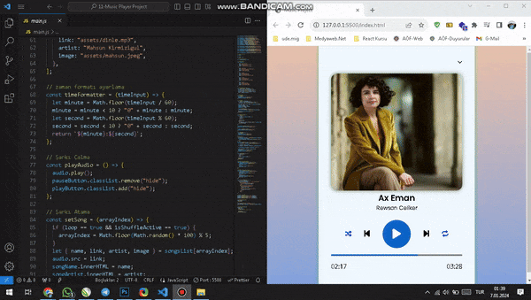

<h2>Music Player Project</h2>

This project is a simple web-based music player project built using HTML5, CSS and JavaScript. It includes features such as play, pause, shuffle and playlist.

<h3>Features<h3>

- Play and pause controls
- Blending functionality
- Playlist with dynamic song loading

<h3>Technologies used in project construction</h3>

- HTML
- CSS
- Javascript

<h3>Screenshot</h3>

